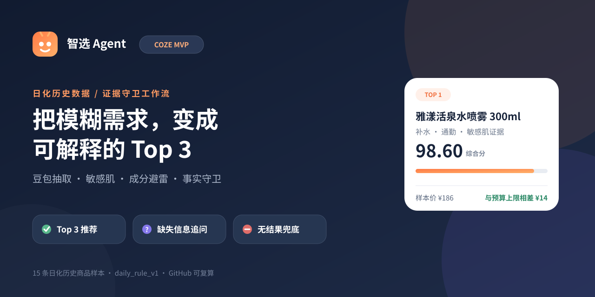
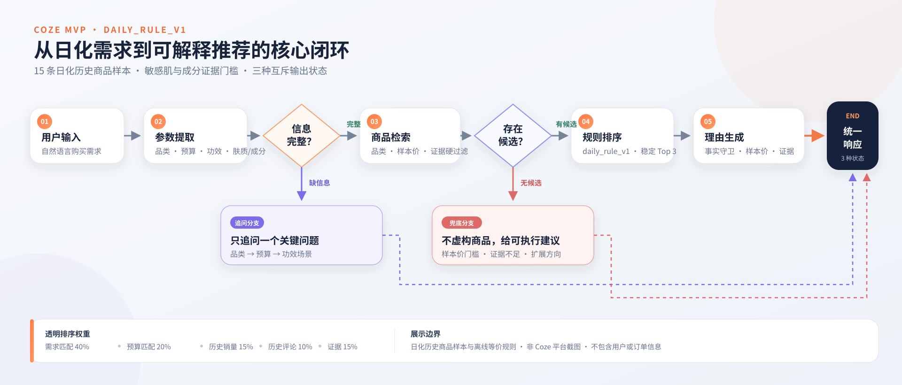
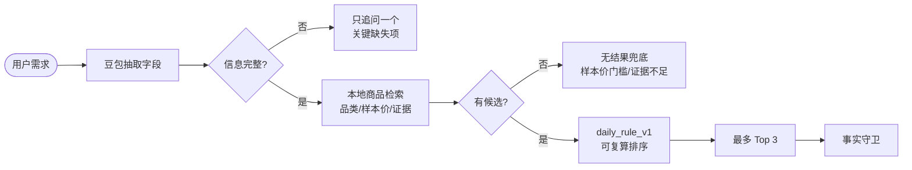

<div align="center">

# 智选 Agent｜日化历史数据 Coze MVP

### 用豆包抽取需求，用可复算规则做功效推荐、敏感肌筛选与成分避雷

`Coze Workflow` · `日化历史数据` · `主动追问` · `证据门槛` · `可解释排序`

[Coze 项目页](https://code.coze.cn/p/7679015075092578350/preview) · [工作流规格](workflow/workflow-spec.md) · [离线用例](examples/input-output.json) · [测试报告](examples/test-report.md)

</div>



## 当前状态

本仓库已将公开等价配置、商品样本、A–D 用例、验证器和文档统一迁移为日化历史数据语义。原有交互结构保持不变：需求抽取、缺失信息时只追问一项、硬过滤、稳定排序、理由生成、事实校验和无结果兜底仍是同一套节点与三种输出状态。

> 重要：当前完成的是 GitHub 子项目中的等价配置与离线复算。Coze 平台画布尚未在本次操作中写入，豆包 Secret 也未代用户配置，因此不声称日化版已完成 Coze 原生运行。

> 字段边界：离线数据中的金额统一写作 **样本价**；工作流不把它包装成实时商品信息。

## 60 秒看懂流程





| 阶段 | 产品决策 | 可检查边界 |
| --- | --- | --- |
| 需求抽取 | 豆包只抽取品类、预算、功效、肤质和避开成分 | 不允许模型发明配方或商品事实 |
| 主动追问 | 每轮只问一项 | `missing_fields` 仍保留全部缺失项 |
| 基础检索 | 品类与样本价是硬约束 | 标题功效词按商家标题证据展示 |
| 敏感肌/避雷 | 启用官方证据门槛 | 没有明确官方来源就不做安全断言 |
| 排序 | 确定性代码复算五个分项 | 大模型不计算分数 |
| 事实守卫 | 覆盖 ID、名称、样本价、差额与证据链 | 理由不得越过商品表字段 |

## 数据怎么用

[`data/products.json`](data/products.json) 是从用户提供的离线日化商品历史快照中清洗、去重并挑选的 15 条商品级样本，每个品类 5 条：

- `name` / `shop` / `sample_price` / `historical_*` 来自历史样本；
- 促销日期标签不进入展示名称；
- 缺失的历史销量或评论保持 `null`，不伪造观测值；
- 订单、顾客、地址、支付和聊天字段均不进入子仓库；
- 原始表不提交到 GitHub。

更详细的清洗与授权边界见 [`data/README.md`](data/README.md) 和 [`DATA_LICENSE.md`](DATA_LICENSE.md)。

## 敏感肌、成分避雷与功效推荐

`verified_attributes` 把两种证据分开：

- `not_verified`：只有历史商家标题，可用于基础功效检索，不用于敏感肌或成分避雷断言；
- `official_current_reference`：产品身份与当前官方页面可匹配，保存成分、明确不添加项、敏感肌声称、核查日期与来源 URL。

当前严格核实子集包含 4 条：雅漾舒护活泉水喷雾 300ml、悦诗风吟控油矿物质散粉 5g、倩碧卓越润肤凝露产品线和倩碧卓越润肤乳产品线。当前官方配方只是参考版本，不倒推历史样本的配方必然完全相同。

## 四个固定用例

| 用例 | 覆盖能力 | 期望状态 |
| --- | --- | --- |
| A | 200 元内补水喷雾，通勤与补水优先 | `recommend` |
| B | 敏感肌保湿乳霜并避开香精，但没有预算 | `need_clarification` |
| C | 控油定妆的样本价上限低于样本库门槛 | `no_result` |
| D | 300 元内敏感肌保湿乳霜，避开香精 | `recommend`，只能返回通过官方证据门槛的商品 |

完整输入、抽取字段、排序分项、排除 ID 与来源 URL 见 [`examples/input-output.json`](examples/input-output.json)。

## 可解释排序：`daily_rule_v1`

```text
score = 0.40 × 需求匹配
      + 0.20 × 预算匹配
      + 0.15 × 历史销量归一化
      + 0.10 × 历史评论归一化
      + 0.15 × 证据质量
```

敏感肌或成分避雷不是软分数，而是排序前的硬门槛：商品必须存在官方来源，敏感肌声称必须为真，每个需避开成分必须明确出现在官方 `formulated_without` 列表中。

## 豆包 API 接入

配置使用三个环境变量，空白模板见 [`.env.example`](.env.example)：

```text
ARK_API_KEY=
ARK_MODEL=doubao-seed-2-0-lite-260215
ARK_BASE_URL=https://ark.cn-beijing.volces.com/api/v3
```

在 Coze 中应把 `ARK_API_KEY` 配置为 Secret，不得写入等价 JSON、截图、输出或 Git 历史。如果 Secret 没有配置，工作流必须明确失败或使用无外部事实的本地抽取兜底，不得伪称已调用豆包。

## 仓库地图

```text
.
├── .env.example                         # 豆包环境变量空模板
├── data/
│   ├── products.json                    # 15 条日化历史商品样本
│   ├── verified-product-attributes.json # 4 条官方来源结构化属性
│   └── README.md                        # 清洗、字段和来源边界
├── workflow/
│   ├── workflow-spec.md                 # 节点、分支、公式与证据规则
│   └── coze-workflow-equivalent.json    # 等价参考配置，不是原生导出
├── examples/
│   ├── input-output.json                # A–D 离线复算用例
│   ├── coze-platform-runs.json          # 平台状态的真实边界
│   └── test-report.md                   # 验收结果
├── scripts/
│   ├── recommendation_core.py           # 确定性过滤与排序
│   ├── generate_examples.py             # 重生成固定用例
│   ├── verify_source_subset.py          # 可选的本地源表核对
│   └── validate_bundle.py               # 公开交付包验证
├── tests/test_bundle.py                  # 负例与证据门槛回归测试
├── docs/                                 # 搭建、密钥与隐私边界
└── media/                                # 仅保留已更新的 SVG 说明图
```

## 本地验证

```bash
python3 scripts/generate_examples.py
python3 scripts/validate_bundle.py
python3 -m unittest discover -s tests -v
```

当前验证器会检查数据结构、样本价命名、四个官方核实记录、A–D 输出复算、敏感肌/避雷门槛、交互节点不变、豆包 Secret 引用和平台状态。

## 交付状态

| 交付项 | 状态 |
| --- | --- |
| 15 条日化历史商品样本 | 已完成 |
| 4 条官方来源的结构化属性 | 已完成 |
| 功效推荐、敏感肌与成分避雷 | 已完成离线规则与回归测试 |
| 原交互节点、三种状态和七字段输出 | 已保留 |
| 豆包 API Secret 引用 | 配置已就绪，真实密钥未写入仓库 |
| Coze 平台日化画布 | 未在本次 GitHub 更新中操作 |
| Coze 日化版原生运行 | 未执行 |

## License

原创代码与原创文档采用 [MIT License](LICENSE)。用户提供的原始数据不进入本仓库；历史商品样本、商标与官方产品事实不因本仓库获得新的权利许可。详见 [`DATA_LICENSE.md`](DATA_LICENSE.md)。
