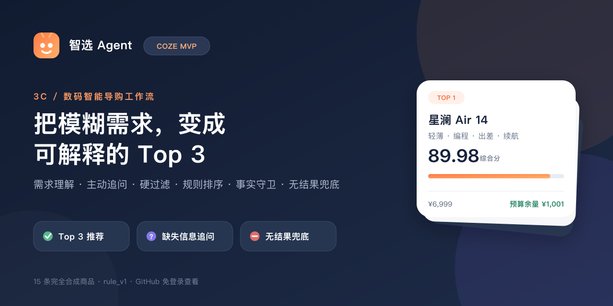
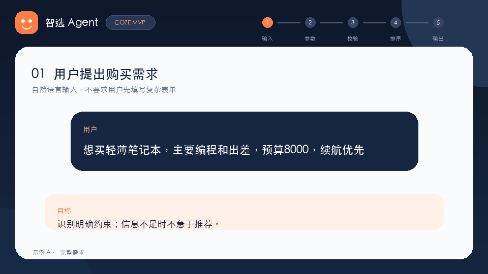
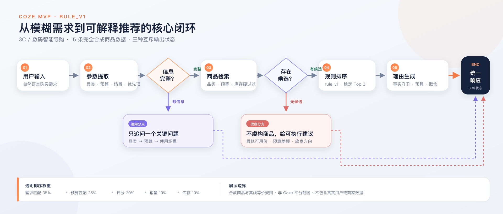
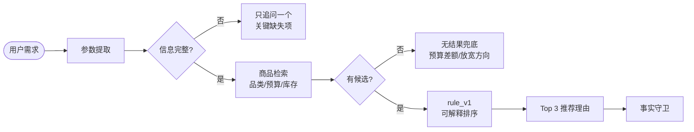

<div align="center">

# 智选 Agent｜Coze MVP

### 把模糊的 3C 购买需求，编排成可追踪、可解释、可兜底的低代码决策流程

`Coze Workflow` · `3C 电商` · `主动追问` · `可解释排序` · `合成数据`

**[立即体验自研完整版 →](https://zhixuan-agent-cn.plupluto.chatgpt.site/)**

[查看 Coze 项目](https://code.coze.cn/p/7679015075092578350/preview) · [查看工作流规格](workflow/workflow-spec.md) · [查看平台运行摘要](examples/coze-platform-runs.json) · [查看测试报告](examples/test-report.md)

</div>





---

## 这是什么

这是「智选 Agent」的 **Coze 核心流程 MVP**：用较小、透明的工作流验证智能导购最关键的产品闭环，而不是把一次大模型回答包装成推荐系统。

用户可以直接说“想买轻薄笔记本，主要编程和出差，预算 8000，续航优先”。流程先把自然语言转成结构化约束；信息不足时只问一个高价值问题；信息完整后执行硬过滤、可解释规则排序和事实受限的理由生成；没有候选时明确说明原因并给出放宽路径。

> **无需登录 Coze 也能审阅。** 本仓库保留流程图、节点契约、15 条合成商品、等价配置、四组输入输出、自动验证与脱敏的原生运行截图。Coze `v0.2.0` 已完成 A–D 四组原生试运行；当前 `v0.2.1` 只替换了 15 个商品名称并通过静态黑名单扫描，原生截图均按实际版本明确标注。项目始终保持未部署。

> **配置说明：** 当前 Coze Coding 项目视图没有提供可直接导入的单文件原生导出。本仓库因此公开 [`coze-workflow-equivalent.json`](workflow/coze-workflow-equivalent.json) 作为结构化等价配置，并用平台项目 ID、版本号、四组原生截图与可运行验证器交叉证明；不会把等价配置冒充成 Coze 原生导出。

## 60 秒看懂核心流程





| 阶段 | 产品决策 | 输出可检查什么 |
| --- | --- | --- |
| 参数提取 | 品类、预算、使用场景、优先项分开表达 | 模型有没有擅自补全用户没说的信息 |
| 主动追问 | 一轮只问最关键的一项 | 对话负担是否可控，`missing_fields` 是否完整 |
| 商品检索 | 品类、预算、库存作为硬约束 | 为什么某商品被排除 |
| 规则排序 | 五个 0–100 分项加权 | 排名是否可复算，而不是“模型觉得” |
| 理由生成 | 只允许引用商品库字段 | 推荐理由是否有事实来源与明确取舍 |
| 无结果兜底 | 返回最低可用价与放宽动作 | 是否拒绝编造不存在的商品 |

## 一个需求如何变成 Top 3

**输入**

```text
想买轻薄笔记本，主要编程和出差，预算8000，续航优先
```

**结构化需求**

```json
{
  "category": "笔记本电脑",
  "budget": 8000,
  "use_case": ["编程", "出差"],
  "priority": ["轻薄", "续航"]
}
```

**本地等价规则结果**

| 排名 | 商品 | 总分 | 预算余量 | 核心适配 | 明确取舍 |
| ---: | --- | ---: | ---: | --- | --- |
| 1 | 星澜 Air 14 | 89.98 | ¥1,001 | 编程、出差、轻薄、续航全部命中 | 集成显卡不适合重度 3D 渲染 |
| 2 | 云帆 Pro 14 | 75.91 | ¥1 | 编程、出差、续航命中 | 1.46kg，并非同组最轻 |
| 3 | 远行 Lite 13 | 74.37 | ¥2,201 | 出差、轻薄、续航命中 | 16GB 内存不可扩展 |

每个分项、候选数量与排除原因都可以在[完整示例](examples/input-output.json)中逐项核对。

## 三种确定的输出状态

| 状态 | 触发条件 | 行为 |
| --- | --- | --- |
| `recommend` | 品类、预算、场景完整，且过滤后有候选 | 返回 Top 3、分项得分、预算关系与一项限制 |
| `need_clarification` | 缺少品类、预算或使用场景 | 返回全部 `missing_fields`，但本轮只问一个问题 |
| `no_result` | 信息完整，但硬过滤后没有候选 | 推荐数组保持为空，返回最低可用价与放宽动作 |

四个固定用例覆盖了三种状态：

- A：轻薄编程本 → Top 3；
- B：只说“降噪耳机” → 先问预算，不提前推荐；
- C：100 元高性能笔记本 → 无结果兜底；
- D：5000 元内拍照手机 → Top 3。

原生 Coze `v0.2.0` 试运行证据：

- [A：完整需求 → `recommend`](evidence/coze-case-a-recommend.png)
- [B：缺预算 → `need_clarification`](evidence/coze-case-b-clarification.png)
- [C：预算过低 → `no_result`](evidence/coze-case-c-no-result.png)
- [D：完整需求 → `recommend`](evidence/coze-case-d-recommend.png)

## 可解释排序：`rule_v1`

商品先通过三项硬过滤：**品类一致、价格不高于预算、库存大于 0**。只有合格候选进入排序：

```text
score = 0.35 × 需求匹配
      + 0.25 × 预算匹配
      + 0.20 × 评分归一化
      + 0.10 × 销量归一化
      + 0.10 × 库存可用性
```

五个分项均为 0–100。代码节点负责过滤、计算、预算差额与稳定排序；大模型只负责把结构化结果表达成自然语言。随后 `FactGuard` 再校验商品 ID、名称、价格、分数和限制，降低理由生成中的事实漂移。

为什么 MVP 选择规则而不是深度学习：15 条合成商品不足以支撑可信的学习排序，规则更适合快速暴露需求抽取、追问时机、过滤边界与解释格式的问题。自研完整版则承担推荐模型、RAG 和离线指标的系统验证。

## 两个版本分别证明什么

| 版本 | 证明什么 |
| --- | --- |
| [自研完整版](https://github.com/LICHENGYAN0316/zhixuan-ai-shopping-agent-cn) | 数据、排序模型、RAG、指标、工程与产品能力 |
| Coze MVP | 工作流编排、快速验证、低代码平台与交付效率 |

**自研完整版在线演示：** [https://zhixuan-agent-cn.plupluto.chatgpt.site/](https://zhixuan-agent-cn.plupluto.chatgpt.site/)

两者不是重复实现：完整版回答“如何把能力做深、做成系统”，Coze MVP 回答“如何用最低交付成本验证核心交互与业务规则”。

## 仓库地图

```text
.
├── README.md
├── data/
│   └── products.json                    # 15 条合成商品，3 个品类
├── workflow/
│   ├── workflow-spec.md                 # 节点、变量、分支、公式与事实边界
│   └── coze-workflow-equivalent.json    # 可读的等价配置；不是原生导出
├── examples/
│   ├── input-output.json                # A–D 四组完整结构化结果
│   ├── coze-platform-runs.json          # 平台版本、原生结果与名称修正范围
│   └── test-report.md                   # 本地验算与 Coze 原生试运行结论
├── scripts/
│   └── validate_bundle.py               # 无依赖的 271 项一致性检查
├── tests/
│   └── test_bundle.py                   # 5 项防回归测试
├── docs/
│   ├── coze-build-notes.md              # 平台项目、版本、限制与搭建记录
│   └── privacy.md                       # 公开边界与截图脱敏清单
├── media/                               # 封面、流程图与免登录 GIF
└── evidence/                            # 脱敏的平台画布与 A–D 原生输出
```

## 免安装审阅路径

本仓库提供两条互补的免登录审阅路径：

1. **快速看作品：** 先看首页 GIF、流程图和 [`evidence/`](evidence/README.md) 的 A–D 原生运行截图；
2. **深入查实现：** 从 [`workflow-spec.md`](workflow/workflow-spec.md) 查看节点与分支，从 [`products.json`](data/products.json) 抽查商品事实，从 [`input-output.json`](examples/input-output.json) 复算结果；
3. **一键验算：** 执行 `python3 scripts/validate_bundle.py` 与 `python3 -m unittest discover -s tests -v`；
4. **看系统完整版：** 打开[自研完整版](https://zhixuan-agent-cn.plupluto.chatgpt.site/)，体验推荐模型、RAG、指标与完整产品 UI。

若要在 Coze 复建，请按 [`coze-build-notes.md`](docs/coze-build-notes.md) 逐节点搭建。`coze-workflow-equivalent.json` 是跨版本可读的配置蓝图，**不能假设可以直接导入 Coze**。

## 数据与真实性

- 品牌、型号、价格、评分、销量与库存均为虚构；
- 不包含真实订单、用户、商家、Cookie、令牌或账号信息；
- 推荐理由只能引用商品记录中的字段；
- `examples/input-output.json` 来自公开等价规则的本地复算，平台截图单独放在 `evidence/`，两者不会混称；
- GIF 是基于合成用例制作的免登录讲解动画，画面中已明确注明“不是 Coze 平台截图”；
- Coze 项目保持未部署，公开仓库不包含账号、令牌、运行日志或个人工作区信息。

详见[隐私与公开边界](docs/privacy.md)。

## 交付状态

| 交付项 | 状态 |
| --- | --- |
| 产品流程与节点契约 | 已完成 |
| 15 条合成商品库 | 已完成 |
| 等价配置与四组离线示例 | 已完成 |
| 本地规则一致性验算 | 271 项断言 + 5 项回归测试通过 |
| Coze 原生项目 | 已完成：`7679015075092578350`，保持未部署 |
| Coze `v0.2.0` 四组原生运行 | A–D 4/4 通过 |
| Coze `v0.2.1` 名称合规修正 | 仅修改 15 个 `name` 字段；静态扫描通过；未把确定性预期冒充新一轮原生运行 |
| 脱敏截图、流程图与 GIF | 已完成 |
| 可直接导入的 Coze 原生单文件导出 | 当前项目视图不提供；已给出等价配置与限制说明 |

## License

本仓库代码与文档采用 [MIT License](LICENSE)。合成商品数据仅用于演示和测试，不代表真实市场信息或购买建议。
