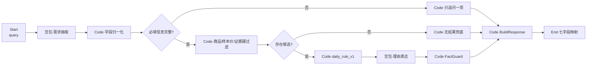

# 智选 Agent｜日化历史数据 Coze MVP 工作流规格

> 等价配置版本：`2.0.0` · 规则：`daily_rule_v1` · 数据：15 条日化历史商品样本

## 1. 目标与边界

该 MVP 保留原有的交互结构，把商品域与事实边界迁移为日化历史数据：

- 用豆包将自然语言抽取为品类、预算、功效、肤质与需避开成分；
- 信息不足时只追问一个高价值问题；
- 品类、样本价与严格证据是硬过滤；
- 确定性代码完成排序和事实校验；
- 没有候选时返回明确的样本库或证据不足说明，不生成库外商品。

该版本不接电商在售库存、下单、支付、广告竞价、用户画像或医疗诊断。金额字段统一命名为 `sample_price`。

## 2. 主流程



节点 ID、分支方向、三种状态与七个顶层输出字段均与原交互契约一致。

## 3. 输入与输出契约

### 输入

| 字段 | 类型 | 必填 | 说明 |
| --- | --- | --- | --- |
| `query` | string | 是 | 用户本轮中文需求 |

### `parsed`

| 字段 | 类型 | 边界 |
| --- | --- | --- |
| `category` | string \| null | `补水喷雾`、`保湿乳霜`、`清洁定妆` |
| `budget` | number \| null | 样本价上限，必须为正数 |
| `use_case` | string[] | 例如补水、保湿、控油、定妆、卸妆、通勤 |
| `priority` | string[] | 用户显式强调的功效或场景 |
| `skin_type` | string \| null | 仅抽取显式肤质；敏感肌会启用证据门槛 |
| `avoid_ingredients` | string[] | 仅抽取用户明确要避开的成分 |
| `requires_verified_evidence` | boolean | 敏感肌、成分或安全性需求时为 `true` |

### 统一输出

```json
{
  "status": "recommend | need_clarification | no_result",
  "parsed": {
    "category": null,
    "budget": null,
    "use_case": [],
    "priority": [],
    "skin_type": null,
    "avoid_ingredients": [],
    "requires_verified_evidence": false
  },
  "missing_fields": [],
  "question": null,
  "recommendations": [],
  "fallback": null,
  "trace": {
    "rule_version": "daily_rule_v1",
    "catalog_version": "2.0.0",
    "retrieval_executed": false,
    "eligible_count": 0,
    "returned_count": 0,
    "excluded_by_category": [],
    "excluded_by_budget": [],
    "excluded_by_evidence": [],
    "same_category_total_count": 0,
    "clarified_field": null,
    "source_nodes": {}
  }
}
```

`recommend`、`need_clarification` 和 `no_result` 互斥，且均必须经过 `BuildResponse` 再进入 `End`。

## 4. 节点规格

| 节点 | 类型 | 关键责任 |
| --- | --- | --- |
| `start` | Start | 只接收并清理 `query` |
| `intent_extract` | LLM / HTTP | 用火山方舟豆包抽取固定 JSON；凭据只来自 `ARK_API_KEY` Secret |
| `normalize_fields` | Code | 归一化品类、预算、功效、肤质和成分别名 |
| `required_fields` | Condition | 必填 `category`、`budget`、`use_case` |
| `clarify_one_field` | Code | 每轮只问优先级最高的一项 |
| `retrieve_catalog` | Code | 执行品类、样本价和证据硬过滤，记录排除 ID |
| `has_candidates` | Condition | 候选数为 0 进兜底，否则进排序 |
| `rule_rank_v1` | Code | 执行 `daily_rule_v1` 并稳定排序，最多取 3 条 |
| `reason_generate` | LLM | 只改写已结构化字段，不产生数值或库外事实 |
| `fact_guard` | Code | 重算样本价差额，校验商品身份、限制与官方证据 |
| `no_result_fallback` | Code | 区分样本价门槛、证据不足和品类未覆盖 |
| `build_response` | Code | 统一三个分支的七字段对象与 trace |
| `end` | End | 逐字段映射 `build_response` 输出 |

## 5. 豆包接入

### Secret 参考

| 名称 | 用途 | Git 政策 |
| --- | --- | --- |
| `ARK_API_KEY` | 火山方舟凭证 | 只存 Coze Secret 或部署环境变量 |
| `ARK_MODEL` | 豆包模型端点 ID | 可用空模板的默认值，不是密钥 |
| `ARK_BASE_URL` | API 根路径 | 可配置，不包含凭证 |

### 调用约束

1. 用严格 JSON Schema 限制输出；
2. 模型只看用户输入和允许的别名表，不将整个商品库暴露给需求抽取节点；
3. 密钥不得出现在提示词、输出、trace、错误文本或截图；
4. 超时或返回不合规时，不进行商品推荐，而是返回可观测错误或无库外事实的本地抽取兜底；
5. 豆包不计算样本价、硬过滤、排序分数或成分安全性结论。

## 6. 参数归一化与追问

### 品类别名

| 用户表达 | 归一化结果 |
| --- | --- |
| 喷雾、化妆水喷雾、补水喷雾 | `补水喷雾` |
| 乳液、面霜、保湿乳霜 | `保湿乳霜` |
| 洁面、卸妆、散粉、定妆 | `清洁定妆` |

### 成分别名

`香料 → 香精`、`paraben/防腐酯 → 对羟基苯甲酸酯`、`乙醇 → 酒精`，`SLS` 与 `SLES` 保持区分。只有用户显式表达“避开”“不要”“不含”时才进入 `avoid_ingredients`。

追问优先级保持为：`category` → `budget` → `use_case`。即使同时缺少多项，`missing_fields` 保留全部缺失项，但本轮 `question` 只有一个。

## 7. 硬过滤与证据门槛

### 基础需求

```text
category == parsed.category
AND sample_price <= parsed.budget
```

### 敏感肌或成分避雷

```text
verified_attributes.status == "official_current_reference"
AND (如需敏感肌) sensitive_skin_claim == true
AND (如有避开成分) 每一项都明确存在于 formulated_without
```

关键原则：

- 商品标题里的“温和”“舒缓”不能代替敏感肌证据；
- 未在官方 `formulated_without` 明确列出的成分，不做“不含”断言；
- 完整成分表和明确不添加表是两种不同证据，分开存储；
- 当前官方页面不用来倒推历史配方版本必然相同。

## 8. `daily_rule_v1`

`demand_tokens = unique(use_case + priority)`，商品匹配文本只包含 `use_cases`、`merchant_title_claims`、`highlights`和有来源的 `official_claims`。

```text
需求匹配                 = 命中 token 数 / token 总数 × 100
预算匹配                 = sample_price / budget × 100
历史销量归一化         = historical_sales_count / 当前候选集最大值 × 100
历史评论归一化         = historical_comment_count / 当前候选集最大值 × 100
证据质量                 = 官方当前参考 100，仅历史标题 25

score = 0.40 × 需求匹配
      + 0.20 × 预算匹配
      + 0.15 × 历史销量归一化
      + 0.10 × 历史评论归一化
      + 0.15 × 证据质量
```

缺失的历史销量或评论在归一化计算时按 0 处理，但原商品记录仍保持 `null`。排序键为总分降序、历史销量降序、样本价升序、ID 升序。

## 9. 事实守卫

`FactGuard` 必须检查：

1. `id`、`shop`、`name`、`sample_price` 与商品库完全一致；
2. `budget_gap = budget - sample_price`；
3. `tradeoff` 来自对应商品 `limitations`；
4. 敏感肌和避雷理由的每一项都可追溯到 `verified_attributes.sources`；
5. 商家标题功效词必须保留证据级别，不升级成成分或安全结论；
6. 不输出个体过敏保证、医疗效果、物流、促销、库存或库外商品。

## 10. 无结果兜底

| 类型 | 条件 | 输出 |
| --- | --- | --- |
| `insufficient_verified_evidence` | 品类和样本价可命中，但敏感肌/避雷证据不足 | 不推荐，说明需补齐官方资料 |
| `budget_below_sample_floor` | 样本价上限低于同品类最低样本价 | 返回样本库门槛与差额 |
| `category_not_covered` | 样本库没有该品类 | 建议扩展对应品类数据 |

## 11. 可复现性与平台证据

- 商品库：[`../data/products.json`](../data/products.json)，版本 `2.0.0`；
- 等价配置：[`coze-workflow-equivalent.json`](coze-workflow-equivalent.json)；
- 固定用例：[`../examples/input-output.json`](../examples/input-output.json)；
- 生成脚本：`python3 ../scripts/generate_examples.py`；
- 交付包验证：`python3 ../scripts/validate_bundle.py`；
- 平台状态：[`../examples/coze-platform-runs.json`](../examples/coze-platform-runs.json)。

等价配置不是 Coze 原生导出，离线复算不是 Coze 运行日志。画布、Secret 或在线调用未实际完成时，不得写为“原生运行通过”。
