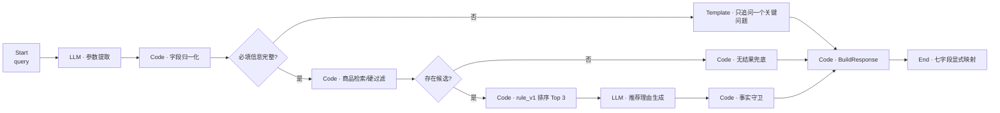

# 智选 Agent｜Coze MVP 工作流规格

> 工作流版本：`1.1.0`　｜　语言：中文　｜　数据：15 条完全合成的 3C 商品

## 1. 目标与边界

本 MVP 用一条可解释、可检查的工作流验证 3C 智能导购的核心闭环：把自然语言需求转成约束，在信息不足时主动追问，在商品库中执行硬过滤与规则排序，最后生成有事实依据的推荐理由；无候选时不给“幻觉商品”，而是给可执行的放宽建议。

本版本刻意不包含用户画像、实时电商接口、支付、广告竞价、在线学习和深度学习排序。排序器是透明的 `rule_v1`，适合快速验证需求理解与产品交互；自研完整版承担数据、模型、RAG、指标与工程能力的展示。

## 2. 主流程



## 3. 输入与输出契约

### 输入

| 字段 | 类型 | 必填 | 说明 |
| --- | --- | --- | --- |
| `query` | string | 是 | 用户最新一轮中文自然语言需求，长度建议为 1–500 字符 |

### 结构化参数

| 字段 | 类型 | 允许值 / 示例 |
| --- | --- | --- |
| `category` | string \| null | `笔记本电脑`、`智能手机`、`头戴耳机` |
| `budget` | number \| null | 预算上限，人民币整数，例如 `8000` |
| `use_case` | string[] | 例如 `编程`、`出差`、`通勤`、`拍照`、`游戏`、`高性能` |
| `priority` | string[] | 例如 `续航`、`轻薄`、`影像`、`降噪`、`性能` |

### 输出

统一返回：

```json
{
  "status": "recommend | need_clarification | no_result",
  "parsed": {
    "category": null,
    "budget": null,
    "use_case": [],
    "priority": []
  },
  "missing_fields": [],
  "question": null,
  "recommendations": [],
  "fallback": null,
  "trace": {
    "rule_version": "rule_v1",
    "catalog_version": "1.0.0",
    "retrieval_executed": false,
    "eligible_count": 0,
    "returned_count": 0,
    "excluded_by_category": [],
    "excluded_by_budget": [],
    "excluded_by_stock": [],
    "same_category_total_count": 0,
    "same_category_in_stock_count": 0,
    "clarified_field": null,
    "source_nodes": {
      "rule_version": "assets",
      "catalog_version": "assets",
      "retrieval_executed": "build_response",
      "eligible_count": "retrieve_catalog",
      "returned_count": "build_response",
      "excluded_by_category": "retrieve_catalog",
      "excluded_by_budget": "retrieve_catalog",
      "excluded_by_stock": "retrieve_catalog",
      "same_category_total_count": "retrieve_catalog",
      "same_category_in_stock_count": "retrieve_catalog",
      "clarified_field": "clarify_one_field"
    }
  }
}
```

三个状态互斥：

- `recommend`：`recommendations` 返回至多 3 个商品；
- `need_clarification`：只返回一个追问，检索与排序不执行；
- `no_result`：不返回虚构商品，只返回 `fallback`。

三个分支都必须进入同一个 `BuildResponse` 节点。该节点为未执行分支补齐空数组、`null` 或计数默认值，再将七个顶层字段显式映射给 `End`；因此任何分支都不会只返回局部对象。

## 4. 节点规格

| 顺序 | 节点名 | Coze 节点类型 | 主要输入 | 主要输出 | 关键规则 |
| ---: | --- | --- | --- | --- | --- |
| 1 | `Start` | 开始 | `query` | `query` | 去除首尾空格；空输入直接报参数错误 |
| 2 | `IntentExtract` | 大模型 | `query` | `raw_intent` | 只抽取显式或可由同义词确定的信息；不得推测预算 |
| 3 | `NormalizeFields` | 代码 | `raw_intent` | `parsed`、`demand_tokens`、`missing_fields` | 统一品类、金额与同义词；预算必须大于 0 |
| 4 | `RequiredFields` | 条件分支 | `missing_fields` | 分支 | 缺失则进入追问；完整则进入检索 |
| 5 | `ClarifyOneField` | 文本处理 | `missing_fields` | `question` | 一次只追问优先级最高的一个字段 |
| 6 | `RetrieveCatalog` | 代码 | `parsed`、商品库 | 候选、排除清单、同品类计数 | 品类完全一致、`price <= budget`、`stock > 0`；同时记录每种排除原因 |
| 7 | `HasCandidates` | 条件分支 | `eligible_products` | 分支 | `length == 0` 进入兜底，否则进入排序 |
| 8 | `RuleRankV1` | 代码 | `eligible_products`、`demand_tokens`、`budget` | `ranked_products` | 计算五个分项与总分，稳定排序后截取 Top 3 |
| 9 | `ReasonGenerate` | 大模型 | `parsed`、Top 3 商品完整记录与得分 | `draft_reasons` | 每项包含适配点、预算差额、一个明确限制 |
| 10 | `FactGuard` | 代码 | 商品记录、`draft_reasons` | `recommendations` | 校验商品 ID、价格、预算差额与限制；异常时使用模板化理由 |
| 11 | `NoResultFallback` | 代码 | `parsed`、同品类商品库 | `fallback` | 给出最低可用价与可执行的放宽方向，不新增商品 |
| 12 | `BuildResponse` | 代码 | 当前已完成分支与公共参数 | 七字段统一对象、`trace` | 首个完成分支触发；补默认值并记录字段来源 |
| 13 | `End` | 结束 | `BuildResponse` | 七个显式输出字段 | 不自行推断分支；严格按字段映射返回 |

### 4.1 三分支统一映射

| 分支 | `status` | `question` | `recommendations` | `fallback` | `retrieval_executed` |
| --- | --- | --- | --- | --- | --- |
| 信息不足 | `need_clarification` | 本轮唯一问题 | `[]` | `null` | `false` |
| 有候选 | `recommend` | `null` | `FactGuard` 的 Top 3 | `null` | `true` |
| 无候选 | `no_result` | `null` | `[]` | `NoResultFallback` 结果 | `true` |

`BuildResponse` 还统一回填 `parsed`、`missing_fields` 和完整 `trace`。`End` 对 `status`、`parsed`、`missing_fields`、`question`、`recommendations`、`fallback`、`trace` 逐字段映射，不直接连接三个业务分支。

## 5. 参数提取与归一化

### 品类别名

| 用户表达 | 归一化结果 |
| --- | --- |
| 笔记本、电脑、轻薄本、游戏本 | `笔记本电脑` |
| 手机、智能机、拍照手机 | `智能手机` |
| 耳机、头戴式、降噪耳机 | `头戴耳机` |

### 需求词归一化

`开发 → 编程`、`差旅/旅行携带 → 出差`、`摄影 → 拍照`、`电池/待机 → 续航`、`便携 → 轻薄`、`ANC → 降噪`、`重度计算 → 高性能`。

预算优先从“预算 8000”“8000 元以内”“不超过 5k”等表达抽取；`k` 乘以 1000。模型输出必须经代码节点转为正整数，解析失败时回到 `budget = null`。

### 缺失字段与追问顺序

必填信息为 `category`、`budget`、`use_case`。追问优先级固定为：

1. `category`：决定检索域；
2. `budget`：决定硬过滤边界；
3. `use_case`：决定需求匹配。

即使同时缺少多个字段，也只询问优先级最高的一项，但 `missing_fields` 返回全部缺失字段。例如“想买降噪耳机”识别出品类与优先项后，返回 `missing_fields = ["budget", "use_case"]`，本轮只问预算。

## 6. 检索与排序

### 6.1 硬过滤

```text
category == parsed.category
AND price <= parsed.budget
AND stock > 0
```

硬条件不参与软打分，任何一项不满足都不能进入候选集。

`RetrieveCatalog` 在同一次确定性代码执行中额外产出：

- `excluded_by_category`：品类不一致的商品 ID；
- `excluded_by_budget`：同品类但高于预算的商品 ID；
- `excluded_by_stock`：同品类、预算内但 `stock <= 0` 的商品 ID；
- `same_category_total_count` 与 `same_category_in_stock_count`。

排除原因按上述顺序互斥计算，避免同一商品被重复归因。追问分支不执行该节点，因此 `BuildResponse` 将这些字段补为 `[]` 或 `0`，并令 `retrieval_executed = false`。

### 6.2 需求匹配

`demand_tokens` 为归一化后的 `use_case + priority` 去重集合。商品侧可匹配文本仅来自 `use_cases`、`features` 与 `highlights`：

```text
需求匹配 = 命中的 demand_tokens 数 / demand_tokens 总数 × 100
```

若 `demand_tokens` 意外为空，需求匹配记为 0；正常流程会在此之前追问使用场景。

### 6.3 其余分项

所有分项范围均为 0–100：

```text
预算匹配     = price / budget × 100                # 已经过 price <= budget 过滤
评分归一化   = clip((rating - 4.0) / 1.0, 0, 1) × 100
销量归一化   = sales / max(当前候选集 sales) × 100
库存可用性   = min(stock / 20, 1) × 100
```

预算匹配表示“接近用户可支付上限”，不是“价格越低越好”；预算余量会单独展示，让用户自行权衡性价比。

### 6.4 总分

```text
score = 0.35 × 需求匹配
      + 0.25 × 预算匹配
      + 0.20 × 评分归一化
      + 0.10 × 销量归一化
      + 0.10 × 库存可用性
```

计算过程保留完整精度，只在输出时四舍五入到小数点后 2 位。排序键依次为：总分降序、评分降序、价格升序、商品 ID 升序，确保结果可复现。

## 7. 推荐理由与事实守卫

每个推荐项必须包含：

1. **为什么适合**：只能引用商品的 `use_cases`、`features` 或 `highlights`；
2. **预算关系**：`budget_gap = budget - price`，非负时写“预算余量”，不得写成“优惠”；
3. **明确取舍**：逐字引用或忠实改写 `limitations` 中的一项。

`FactGuard` 不使用大模型判断事实，而是进行确定性校验：

- 商品 ID 必须存在于本次 Top 3；
- 名称、价格、库存与总分以代码节点结果覆盖模型文本；
- 预算差额重新计算；
- 理由中若缺少有效限制，回退到商品第一条 `limitations`；
- 禁止输出商品库以外的规格、促销、物流承诺或竞品结论。

## 8. 无结果兜底

兜底节点从同品类且有库存商品中计算 `available_price_floor`：

- 如果预算低于最低价：建议把预算提高到最低可用价，并显示差额；
- 如果需求过窄：建议放宽一个优先项，但不替用户自动修改条件；
- 如果同品类有商品但全部无库存：返回 `fallback_type = no_stock`，将最低可用价与预算差额设为 `null`，建议稍后再查或更换品类；
- 如果商品库没有该品类：返回 `fallback_type = category_unavailable`；
- 不生成具体的库外商品，也不把二手商品当作本商品库候选。

## 9. Trace 字段来源

`trace.source_nodes` 是机器可读的来源映射，避免把默认值误认为已执行节点的结果：

| trace 字段 | 来源节点 |
| --- | --- |
| `rule_version`、`catalog_version` | `assets` |
| `retrieval_executed`、`returned_count` | `build_response` |
| `eligible_count`、三类 `excluded_by_*`、两个同品类计数 | `retrieve_catalog` |
| `clarified_field` | `clarify_one_field` |

即使追问分支未运行检索，来源映射仍保持不变；此时 `retrieval_executed = false` 明确说明检索类字段只是统一契约的默认值。

## 10. 可复现性与版本

- 商品库：[`../data/products.json`](../data/products.json)，版本 `1.0.0`；
- 等价配置：[`coze-workflow-equivalent.json`](coze-workflow-equivalent.json)；
- 规则版本：`rule_v1`；
- 固定测试：[`../examples/input-output.json`](../examples/input-output.json)；
- 标准库验证：`python3 ../scripts/validate_bundle.py`；
- 本地验算与 Coze 平台实测必须分开标注，平台未实测时不得写“Coze 运行通过”。
